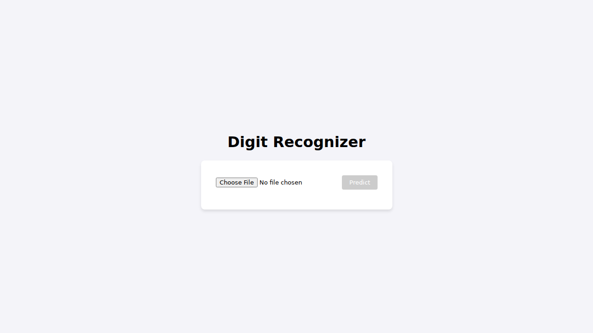

# Deep Learning and CNNs

## What is Deep Learning?

Deep learning is a subset of machine learning that uses neural networks with many layers (hence "deep") to learn and extract features from data. It excels at tasks involving large amounts of unstructured data such as images, audio, and text.

## Why are CNNs Used?

Convolutional Neural Networks (CNNs) are a type of deep learning architecture most commonly used for image-related tasks, such as classification, object detection, and segmentation.

**Key reasons CNNs are used:**
- **Feature Extraction:** CNNs automatically learn spatial hierarchies of features from input images using convolutional layers.
- **Parameter Efficiency:** Convolutions use shared weights, reducing the number of parameters compared to traditional neural networks and improving generalization.
- **Translation Invariance:** By scanning local patches in images, CNNs are robust to shifts and distortions.
- **State-of-the-Art Performance:** CNNs power many of the most accurate and efficient solutions in computer vision, outperforming previous methods.

In summary, CNNs are widely adopted in deep learning because they are efficient, scalable, and particularly effective for visual data.

---

## Digit Recognizer Application

This project includes a web application that uses a trained CNN model to recognize handwritten digits. The backend is built with FastAPI, and the frontend is a simple interface created with Vue.js.

### Screenshot



### How to Run the Application

Follow these steps to set up and run the application on your local machine.

**1. Prerequisites**

*   Python 3.7+
*   pip

**2. Clone the Repository**

```bash
git clone <repository-url>
cd <repository-directory>
```

**3. Set Up the Backend**

First, install the required Python packages:

```bash
pip install -r requirements.txt
```

The application uses a pre-trained Keras model. To generate this model, you need to run the Jupyter notebook:

```bash
pip install jupyter matplotlib
jupyter nbconvert --to notebook --execute deep_learning.ipynb
```

This will create a `my_digit_reader.keras` file in the root of the project.

**4. Start the Backend Server**

With the model generated, you can now start the FastAPI server:

```bash
uvicorn main:app --reload
```

The backend will be running at `http://127.0.0.1:8000`.

**5. Access the Frontend**

Once the backend is running, you can access the frontend by opening your web browser and navigating to:

[http://127.0.0.1:8000](http://127.0.0.1:8000)

You can now upload an image of a handwritten digit and get a prediction from the model.
